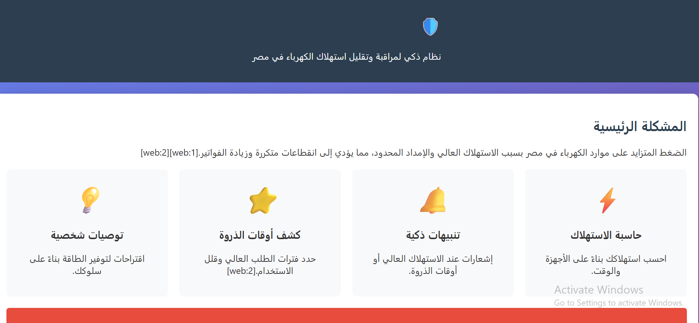
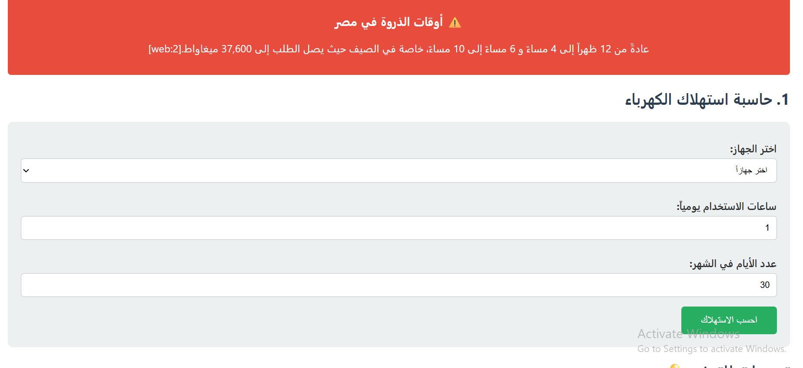
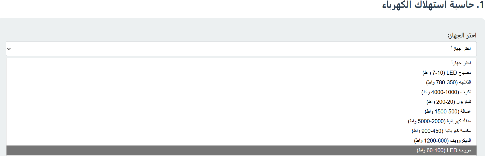
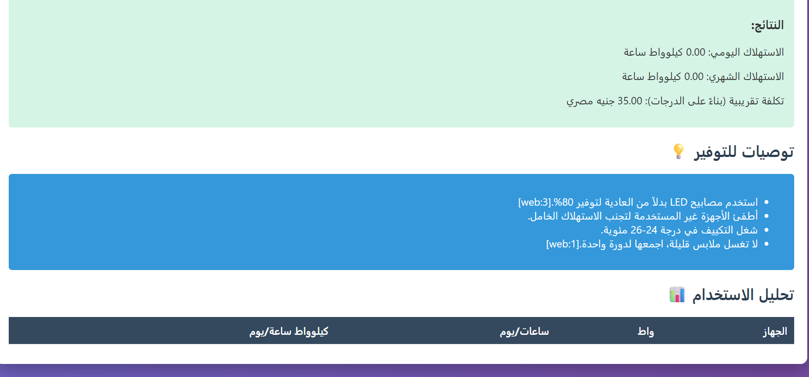

# ⚡ Smart Power Egypt

Smart Power Egypt is a web-based application developed using HTML, CSS, and JavaScript to help users monitor and estimate their electricity consumption. The application calculates daily and monthly energy usage, estimates electricity costs, and provides personalized recommendations to reduce energy consumption based on user behavior.

---

## ✨ Features

- 🏠 User-friendly home page

- ⚡ Electricity consumption calculator

- 🔌 Select electrical appliances from a predefined list

- ⏱️ Calculate daily and monthly energy consumption

- 💰 Estimate monthly electricity cost

- 💡 Personalized energy-saving recommendations

- 📊 Peak hours awareness

- 📱 Responsive design

---

## 🛠️ Technologies Used

- HTML5

- CSS3

- JavaScript

---

## 📷 Screenshots

### 🏠 Home Page

---

### ⚡ Electricity Calculator

---

### 🔌 Device Selection

---

### 📊 Calculation Results

---

### 💡 Energy Saving Tips

---

## 🚀 Future Improvements

- User accounts and login system

- Save calculation history

- Interactive charts for energy usage

- Dark Mode

- Multi-language support

- Real electricity tariff updates

---

## 👩‍💻 Developed By

**Maha Khaled**

Computer Science Student